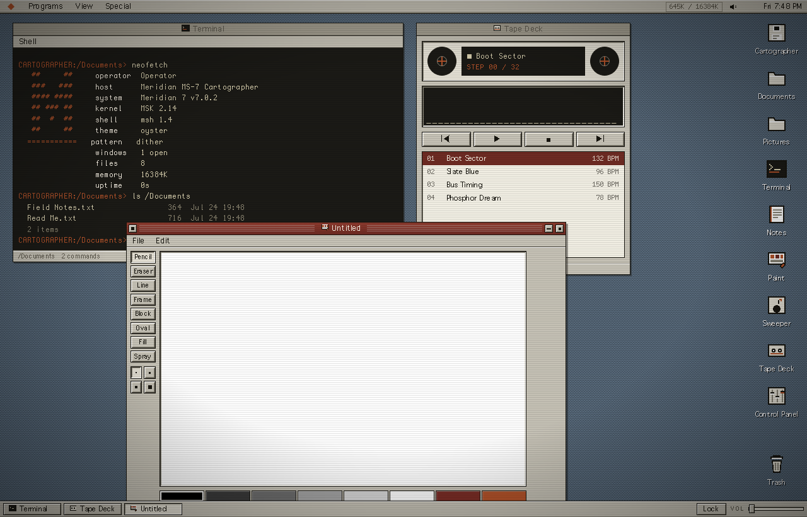
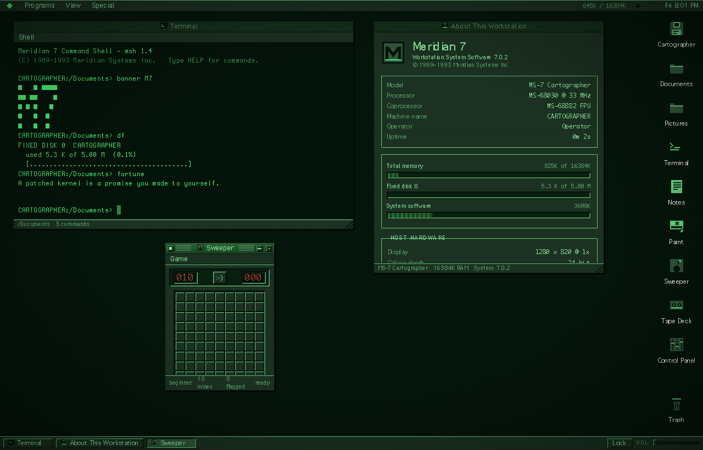

<div align="center">

# 📟 MERIDIAN 7

**A fictional 1989 workstation operating system that boots in your browser — eleven programs, six colour schemes, and not one audio file**

[](https://developer.mozilla.org/en-US/docs/Web/JavaScript)
[](https://developer.mozilla.org/en-US/docs/Web/API/Web_Audio_API)
[](#%EF%B8%8F-tech-stack)
[](#-getting-started)
[](LICENSE)

[Features](#-features) · [Getting Started](#-getting-started) · [The Programs](#-the-programs) · [Making It Yours](#-making-it-yours) · [How It Works](#-how-it-works) · [Tech Stack](#️-tech-stack)

</div>

---

<div align="center">



</div>

---

Most retro-desktop pages are a wallpaper with some draggable divs on top. Meridian 7 is a whole machine: it will not show you a desktop until you press the power button on the monitor, and then it counts 16384K of memory, probes a bus that does not exist, mounts a fixed disk called Cartographer, and plays a four-note chime it generates on the spot.

It is not a clone of System 7 or Workbench or Motif. It borrows their grammar — hard bevels, 1px ink outlines, pinstriped title bars, the close box on the **left** — and spends it on its own machine, the MS-7 Cartographer, sold by a company that never existed. Everything you make in it is real: files you write in the Terminal open in Files, pictures you draw in Paint open in the Viewer, and all of it survives a restart.

There is no build step, no framework and no dependency. `open index.html` and it runs.

## ✨ Features

- **A real startup** — ROM banner, POST with a memory count ticking up in 1024K steps, disk probe, splash screen with extension icons marching in, then the chime. Full, Fast or Instant, and `ESC` skips
- **A proper window manager** — outline dragging (the window lands when you let go, the way it used to), corner-grip resize, zoom, collapse, click-to-focus z-ordering, tile and stack, and a task strip along the bottom
- **A real filesystem** — a tree in `localStorage` that every program shares. `echo hello > notes.txt` in the Terminal and the file is in Files a moment later, in Notes a moment after that
- **Eleven programs** — Terminal, Files, Notes, Paint, Picture Viewer, Calculator, Sweeper, Tape Deck, Control Panel, About This Workstation and a six-page Handbook
- **~35 shell commands** — `ls` `cd` `cat` `mkdir` `mv` `cp` `rm` `tree` `find` `wc` `df` `ps` `kill` `open` `theme` `wall` `vol` `sfx` — with history, tab completion, quoted paths, and `neofetch`, `banner`, `cowsay`, `matrix` and `fortune` for the pleasure of it
- **Six colour schemes** — including two monochrome CRT sets. Nothing hardcodes a hex value, so the icons, gauges, the terminal and the desktop pattern all repaint together
- **Eight desktop patterns** — generated on a canvas at runtime from the active scheme, so the desk always matches the chrome
- **A CRT layer** — scanlines, vignette and a slow flicker over the whole screen, strength adjustable, or off
- **Sound with no sound files** — every click, chime, error beep and the entire Tape Deck is oscillators and noise buffers built at runtime in `js/core/audio.js`
- **A screen saver** — starfield, bouncing logo or no-signal static, on an idle timer you set
- **A shutdown sequence** — that ends the only way it can: *It is now safe to close this window.*

## 🚀 Getting Started

**1. Clone**

```bash
git clone https://github.com/markksantos/meridian7.git
cd meridian7
```

**2. Open it**

```bash
open index.html
```

That is the whole install. Every script is a classic script under one global (`M7`), so it runs straight off disk — no server, no module resolution, no network.

If you would rather serve it:

```bash
node serve.mjs          # http://localhost:6060
```

**3. Press the power button.**

That click is also what unlocks Web Audio — the machine physically cannot chime until you turn it on.

### Keys

| Input | Action |
|-------|--------|
| `ESC` | Skip the startup sequence · dismiss a dialog |
| `ENTER` | Confirm the default button in a dialog |
| `TAB` | Complete a command or path in the Terminal |
| `↑` `↓` | Walk Terminal history |
| `Ctrl-L` | Clear the Terminal |
| `Ctrl-S` | Save in Notes |
| `Ctrl-Z` | Undo in Paint |
| Right-click | Context menus — on the desktop, on icons, on files, in folders |
| Double-click title bar | Zoom a window and back |

## 📟 The Programs

| Program | What it does |
|---------|--------------|
| **Terminal** | ~35 commands over the real filesystem. History, tab completion, quoted paths, `man` for any command |
| **Files** | Browse, rename, duplicate, trash. Icon and list views, breadcrumb path, Get Info |
| **Notes** | Text editor with File/Edit menus, open and save into any folder, live line/word/char count |
| **Paint** | 288×184 canvas, 16 colours, 8 tools, flood fill, invert, dither wash, 12-step undo. Saves `.pic` |
| **Picture Viewer** | Opens what Paint writes, 1×–4×, hands files back to Paint for editing |
| **Calculator** | Four functions, one memory register, a paper tape, full keyboard control |
| **Sweeper** | Minesweeper. Three field sizes, flags, chording, a face that reacts |
| **Tape Deck** | Four synthesized chiptune tracks, transport, spinning reels, live spectrum |
| **Control Panel** | Appearance · Sound · System · Storage. Every knob persists |
| **About This Workstation** | Invented specs beside your real host hardware, uptime, memory and disk gauges |
| **Handbook** | Six pages of in-system documentation, because the machine should explain itself |

## 🎨 Making It Yours

<div align="center">



*The same system in **Phosphor**. Icons, gauges, borders and the desktop repaint from one token set.*

</div>

| Scheme | Reads as |
|--------|----------|
| **Oyster** | Warm beige plastic, oxblood title bars — the default |
| **Graphite** | Cool steel and navy |
| **Ferro** | Oxide red, industrial |
| **Blueprint** | Drafting navy and cyan |
| **Phosphor** | Green CRT monochrome |
| **Amber** | Amber CRT monochrome |

Everything else is in the Control Panel: eight desktop patterns, CRT strength, the pixel arrow cursor, master volume, interface effects, key clicks, the startup chime, boot mode, screen saver and its idle delay, plus your operator and machine names — the machine name is the Terminal prompt.

Storage can reset preferences without touching your files, or erase the disk back to its factory contents. Both ask first.

## 🔧 How It Works

> **Write-up:** [AudioContext was not allowed to start: make the click the UI](https://nosleeplab.com/notes/audiocontext-not-allowed-to-start-user-gesture) — why the power button is the first thing on screen.

```
boot.js    power button → POST → splash → chime → desktop
               ↓
store.js   preferences + icon positions  ─┐
vfs.js     the filesystem tree            ├─ localStorage, nothing else
               ↓                          ┘
wm.js      windows, focus, drag, resize, task strip
theme.js   one token set → chrome, icons, gauges, desktop pattern
audio.js   oscillators + noise buffers → every sound in the system
               ↓
js/apps/*  eleven programs, each one file, each registering itself
```

A few things worth knowing before editing it:

- **Colour is fully tokenised.** No component hardcodes a hex value. That single rule is what makes the two CRT themes possible — and it is also what broke them at first: `--ink` was doing double duty as both the 1px outline colour and the text colour, which is invisible when the chrome itself is dark. Text now has its own `--text` and `--text-dim`.
- **Windows drag as an outline, not live.** A ghost `div` follows the pointer and the window jumps to it on release. That is period-correct *and* free — no layout on pointermove.
- **The Terminal's caret is drawn by hand.** A real `<input>` sits in the line at 1px wide and zero opacity to catch keys; the visible line is a mirror span, a block caret and a tail span, re-synced on every keystroke. A browser caret is a thin bar, and 1989 does not have thin bars.
- **Paths tolerate spaces.** Tokenising honours quotes, and single-path commands fall back to the raw remainder if it resolves — so `cat Read Me.txt` works, unquoted, the way anyone would actually type it.
- **The power button is load-bearing.** Browsers will not let a page make sound until the user interacts with it. Rather than hide that behind a "click to enable audio" banner, the constraint became the first thing you see.
- **Desktop patterns are canvas, not CSS.** Each is drawn into an 8×8 canvas tinted with the live theme variables and handed over as a data URI, so a theme change repaints the desk for free.

## ⚙️ Performance

Nothing animates unless it has to. The desktop is a repeating 8×8 data-URI tile, windows composite as plain positioned divs, and dragging touches one ghost element instead of relaunching layout. The only continuous work in the system is the Tape Deck's spectrum and the screen saver, and both stop when their window closes.

Total weight is about 5,500 lines across 24 files, with zero bytes of dependency, zero images and zero fonts — the icons are inline SVG on a 16×16 grid and the type is whatever Geneva and Monaco your machine already has.

## 🛠️ Tech Stack

| What | How |
|------|-----|
| Language | Vanilla JavaScript, ES5-style, one global namespace |
| Windowing | Hand-rolled — drag, resize, z-order, focus, menus, modals |
| Filesystem | JSON tree in `localStorage`, shared by every program |
| Sound | Web Audio — oscillators, noise buffers, per-event envelopes |
| Music | A 16th-note sequencer over the same synth |
| Icons | Inline SVG, 16×16 grid, `shape-rendering: crispEdges` |
| Theming | CSS custom properties, six palettes, zero hardcoded colour |
| Patterns | Canvas → data URI, regenerated per theme |
| Type | Geneva and Monaco — no webfonts |
| Build | None |

## 📄 License

[MIT](LICENSE) © Mark Santos
